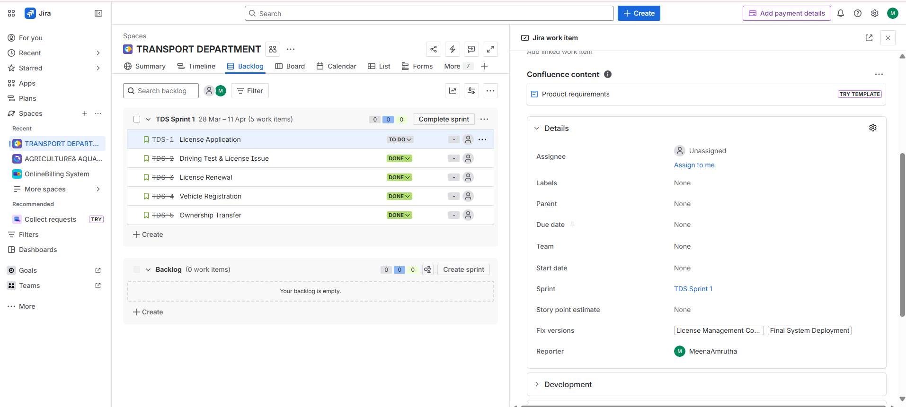

# 🚗 Transport Department System (Jira Project)

## 📌 Project Overview

This project demonstrates the use of Jira for managing a Transport Department system using Scrum methodology.

## 🧩 User Stories

* License Application
* Driving Test & License Issue
* License Renewal
* Vehicle Registration
* Ownership Transfer

## ⚙️ Issues

* Document Verification Delay
* System Errors in Vehicle Registration
* Delay in Driving Test Scheduling

## 🏁 Milestones

* License Management Completion
* Vehicle Services Completion
* Final System Deployment

## 🔄 Sprint

* TDS Sprint 1 (Completed)

## 📸 Screenshots

### Backlog

### Board

### Releases

### Story

## ✅ Conclusion

Successfully implemented Agile Scrum workflow using Jira.
